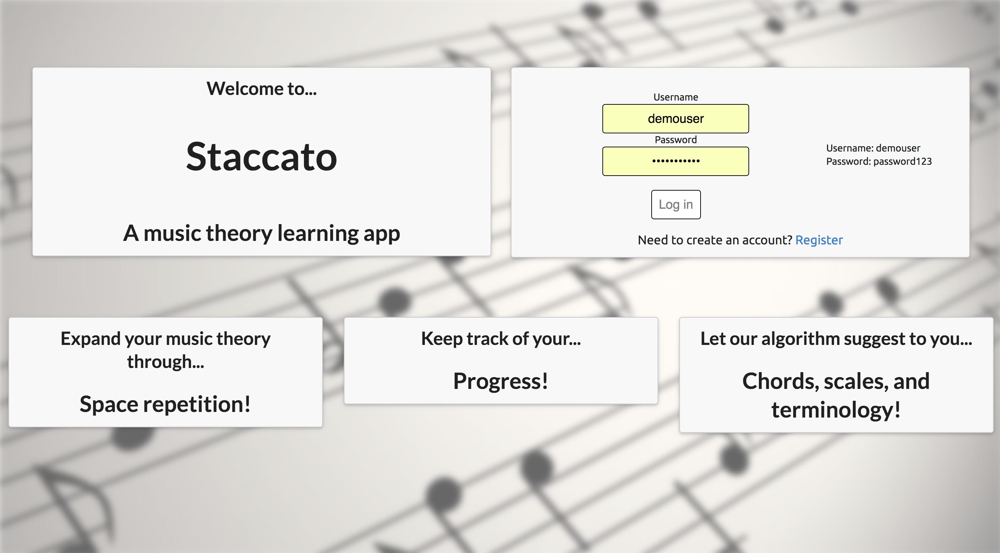
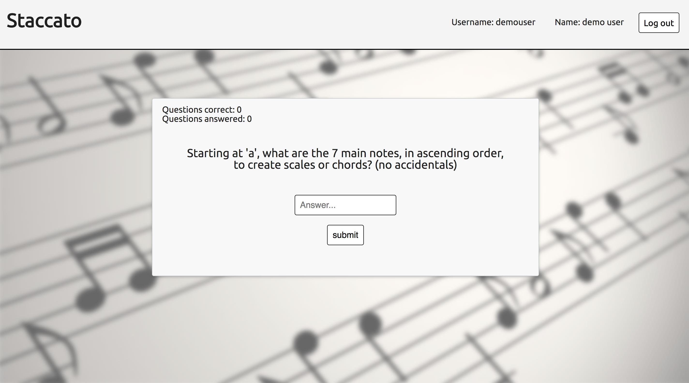
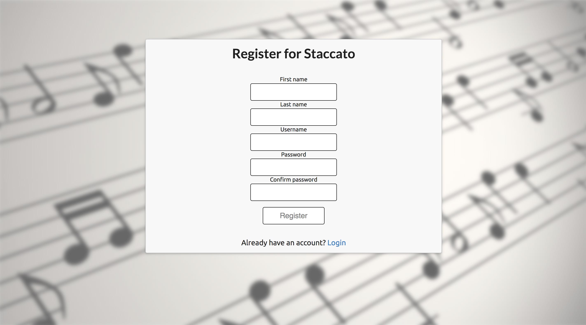

# Staccato music theory learning app

By Jacob Zimmerman and Kevin Murphy

### Live App

live URL: https://staccato-music-theory.netlify.com/ 
presentation URL: https://docs.google.com/presentation/d/1Hh_dexhUuFX-mGzv-waDD4nG3XkVoRf3HIys4eyZoHQ/edit#slide=id.g35f391192_00

### About this app

This app is for anyone trying to learn the basics of music theory. It suggests questions based upon a spaced algorithm to help you focus on information you find difficult. We came about this idea based on both of our own experience learning music theory and decided to make an app to help others.

### Screencaps

## Minimum Viable Product (MVP)

- Clear and fluid onboarding page that helps guide UX
- Signup
- Login
- A clear logout procedure
- Algorithm used to suggest questions based on what the user gets wrong
- Mobile responsive layout
- Persistance of data
- Effective implementation of user authentication

## How it was built

This app was built using a MERN stack
- React
- Redux
- MongoDB
- Node
- Express
- CSS

The design is intended to allow for fluid UX while staying simple to highlight app development rather than graphic design.
